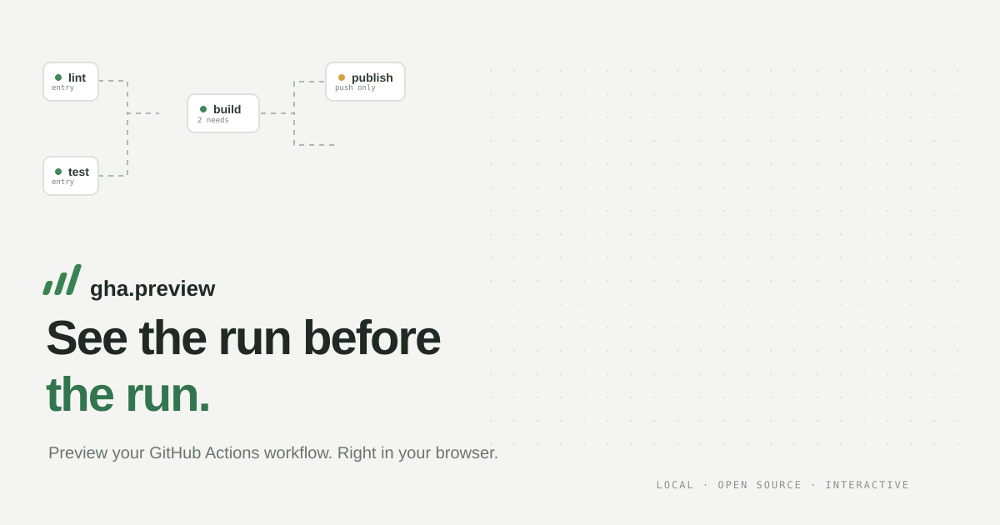
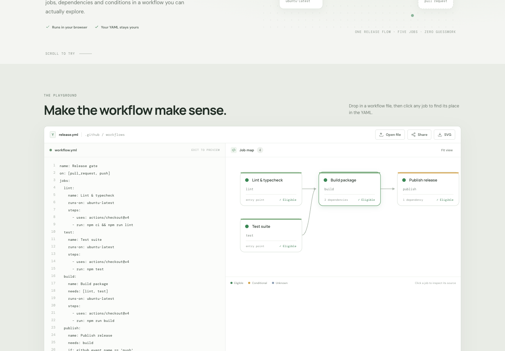
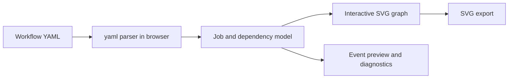

<div align="center">
  

  <br />

[](https://github.com/maximilianfeix/gha-preview/actions/workflows/ci.yml)
[](https://github.com/maximilianfeix/gha-preview/actions/workflows/codeql.yml)
[](https://maximilianfeix.github.io/gha-preview/)
[](https://github.com/maximilianfeix/gha-preview/stargazers)
[](LICENSE)

  <h3>See the run before the run.</h3>
  <p>Paste a GitHub Actions workflow. Explore the job graph, preview an event, and jump back to the exact YAML line — privately in your browser.</p>

  <p><a href="https://maximilianfeix.github.io/gha-preview/"><strong>Try the live preview ↗</strong></a> &nbsp;·&nbsp; <a href="#quick-start">Run it locally</a> &nbsp;·&nbsp; <a href="#how-it-works">How it works</a></p>
</div>

<br />

## A workflow you can actually see



### Try it in 20 seconds

1. [Open the live preview](https://maximilianfeix.github.io/gha-preview/).
2. Select `push` to see the release job become eligible; choose `pull_request` to see it skipped.
3. Click **Build package** to inspect its dependencies and jump to its YAML source.

## Why gha-preview?

GitHub Actions workflows are written as YAML, but the thing they describe is a graph: jobs wait for other jobs, conditions change what can run, and one small `needs:` edit can reshape the whole pipeline. gha-preview makes that structure visible before a push.

Open the [live playground](https://maximilianfeix.github.io/gha-preview/), edit the sample, or drop a `.yml`/`.yaml` file onto the editor. The graph updates as you type. Select a job to inspect its condition, runner, steps, and source line.

```text
lint ──────┐
           ├── build ─── publish (push only)
tests ─────┘
```

## What it does

- **Shows the job graph.** Follow `needs:` links, identify entry points, and spot missing jobs or dependency cycles.
- **Previews common events.** Select a declared trigger to see which jobs are eligible, skipped by a simple event condition, or need runtime context.
- **Links the map to the source.** Select a job, step, or diagnostic to jump to its YAML line.
- **Exports a clean SVG.** Save the current dependency map for a pull request, issue, or README.
- **Shares a reproducible example.** Copy a URL with compressed YAML in the URL fragment. The workflow is not sent to the site server, but anyone with the link can read it.
- **Keeps analysis local.** YAML parsing and rendering happen in the browser. There is no account, API key, analytics, or workflow upload.
- **Gets out of your way.** Drop a workflow file into the editor or open it with the file picker; files over 1 MB are rejected before parsing.

Workflow files and share links are limited to 1 MB. Remove secrets before copying a link; the URL is readable by anyone who receives it.

### A careful preview

gha-preview is a static preview, not a GitHub runner. It understands workflow triggers, job dependencies, basic `if` checks against `github.event_name`, job names, runners, steps, and matrix presence. Conditions that depend on expressions, secrets, job results, or other runtime data are labelled **Needs context** instead of guessed. Branch, path, tag, and activity-type filters are not evaluated, so jobs stay unresolved when a selected event uses one. A job marked **Eligible** could still be skipped or fail when GitHub evaluates the complete workflow.

It does not validate every part of the GitHub Actions expression language, start containers, expand every matrix combination, or execute shell commands. Use [actionlint](https://github.com/rhysd/actionlint) and a real GitHub Actions run for validation and execution.

## Quick start

```bash
git clone https://github.com/maximilianfeix/gha-preview.git
cd gha-preview
npm install
npm run dev
```

Open the local URL printed by Vite. Your workflow stays in your browser. To check the parser and production build:

```bash
npm run check
```

## How it works



The small TypeScript engine reads node locations from the YAML syntax tree, builds job dependencies, checks for missing references and cycles, and lays out a left-to-right graph. The UI renders that model as SVG and uses the recorded source locations for navigation. No backend is involved.

## Development

```bash
npm install
npm run dev       # local development server
npm test          # parser, dependency, layout, and preview tests
npm run build     # type-check and create dist/
npm run check     # tests and production build
```

GitHub Actions runs the test suite and production build on Node 20, 22, and 24, audits dependencies, runs CodeQL, and deploys the site to GitHub Pages from `main`. Releases are created from `v*.*.*` tags with generated notes.

## Contributing

Bug reports and focused pull requests are welcome. Please redact secrets from sample workflows; issue submissions are public. See [CONTRIBUTING.md](CONTRIBUTING.md), the [bug report](https://github.com/maximilianfeix/gha-preview/issues/new?template=bug.yml), or [feature idea](https://github.com/maximilianfeix/gha-preview/issues/new?template=feature.yml).

## Roadmap

- [x] Browser-only YAML editor and interactive job graph
- [x] Click-through source locations, diagnostics, SVG export, and compressed share links
- [x] Conservative preview for common workflow events
- [ ] Better readability for large workflows: zoom, pan, and matrix expansion
- [ ] More expression helpers, with explicit unknown states for runtime-only values
- [ ] Visual diff between two workflow revisions

Ideas are tracked in [GitHub Issues](https://github.com/maximilianfeix/gha-preview/issues). Tell us which workflow shape you need to understand.

## License

MIT. See [LICENSE](LICENSE).
